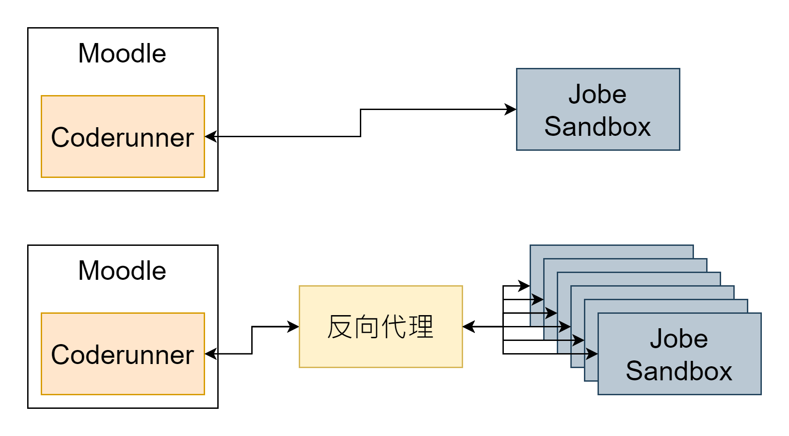
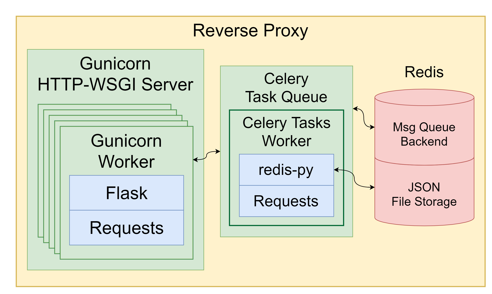
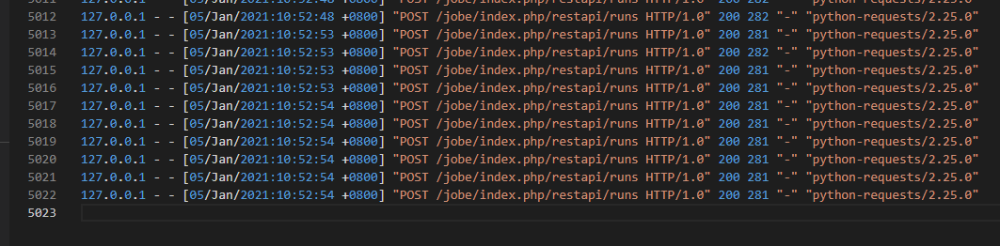
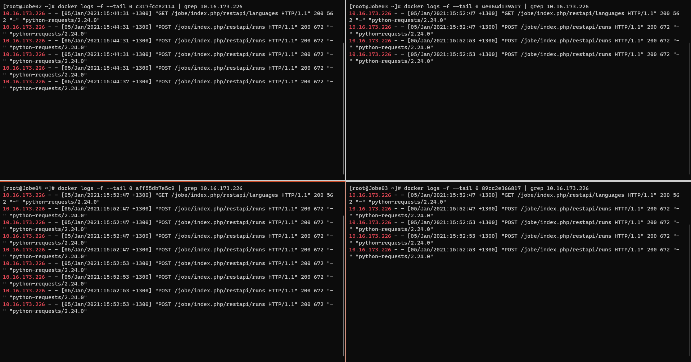

# 專題報告書

## 摘要

Online Judge中文為「線上評判系統」：在線上評判系統中，用戶需要將程式碼提交至系統中，系統會編譯並執行用戶所提交的程式碼，然後將其得到的輸出與題目設定的正確結果比較，最後給予使用者評判結果。

當前市面上常被使用的Online Judge系統，大多數因為只使用單一伺服器執行評判，很容易因為過多人使用，而導致使用者的提交長時間被佇列著，無法於短時間內得到評判結果，更有可能無法得到評判結果，這樣對於需要馬上得知結果並修正程式的使用者造成困擾。

基於此問題，我們希望建置一個Online Judge系統，可以有多個評判伺服器分攤評判的附載，並使用向代理伺服器的方式分派評判需求給評判伺服器，藉以達到負載均衡。

**關鍵詞**：Online Judge；線上評判系統；反向代理伺服器；負載均衡。

---

## 第一章、緒論

### 1.1 製作動機與目的

近來隨著科技發展日新月異，程式設計可以說是現代學生必備的技能，為了培養學生的邏輯能力與運算思維，我國於 108 課綱首度將「程式教育」納入國、高中必修的課程。學生可以透過Online Judge來不斷的找題目練習，來增加自己的程式能力。Online Judge中文為「線上評判系統」。在線上評判系統中，用戶需要提交原始碼至伺服器，伺服器會編譯用戶的原始碼，然後執行原始碼生成的可執行檔，得到其輸出的結果，並與正確結果比較。

大學時期，我們接觸過的Online Judge系統主要有兩個，一個是教育部智慧創新跨域人才培育計劃的程式自學平台(ITSA e-tutor)[1]，另一個是UVA Online Judge[2]，兩者使用經驗皆不是很好，都有一些缺點：ITSA e-Tutor主要缺點是它的「網頁伺服器」與「評判伺服器」都在同一台伺服器中，這種前端與後端未分離的設計，增加了系統升級的困難。此系統以前還在使用舊版本的作業系統時，因為不支援Python 3.x的版本，所以在Python 3推出多年以後，學生還是只能繼續寫Python 2.x的程式。UVA Online Judge則是系統的附載能力不佳，繳交出去的程式碼時常被佇列起來，並過了很長時間都沒有評判結果。我們曾經使用此Online Judge系統做課堂考試，結果造成系統大塞車，這樣狀況對於考試中的學生以及其他需要馬上得知結果且修正程式的使用者，造成極大的困擾。

由此可見，如果沒有建立功能完善的Online Judge系統，會影響到想花時間自我練習程式設計的學生的受教育權益，甚至可能使他們對於程式設計感到心灰意冷而放棄學習。為了不要讓這樣的情形成真，我們想要開發一個「負載均衡的Online Judge系統」，鼓勵更多學生加入學習程式設計的行列。

---

## 第二章、專題架構與相關技術

### 2.1 Online Judge分類和選擇

Online Judge系統依性質來分可分為兩大類，一類是純粹評判程式設計練習題的Online Judge系統，例如ZeroJudge[3]，另一類則是結合線上教學評量系統的Online Judge系統，例如Moodle LMS外掛套件Virtual Programming Lab[4]。ITSA e-Tutor則是嘗試將這兩類系統結合成一體的Online Judge系統。為了選擇合適的Online Judge系統，我們比較了網路上多套開放原始碼的系統，如表1.1所示，由於我們的需求是要建立教學性質的Online Judge，所以我們也將Moodle LMS的外掛套件納入尋找範圍。

表 1.1 不同Online Judge系統比較

| Online Judge 名稱 | 網頁伺服器與評判伺服器設於同一主機 | 評判伺服器數量 | 評判伺服器 | 提供API |
| --- | --- | --- | --- | --- |
| ZeroJudge | 是 | 單一 | 內嵌於ZeroJudge中 | 否 |
| QDUOJ[5] | 分離 | 可多台 | Judger Sandbox | 是 |
| Virtual Programming Lab | 分離 | 單一 | VPL Jail System | 否 |
| CodeRunner[6] | 分離 | 單一 | Jobe Sandbox | 是 |

因為CodeRuner的系統設計上較為精簡，有較完整的API文件，而且因為是要建立具教學性質的Online Judge系統，最終我們選擇了它作為此專題的Online Judge系統基礎。

### 2.2 相關技術與工具

#### 2.2.1 RESTful API

API為Application Programming Interface的縮寫，中文為「應用程式介面」，是一種定義多個軟體之間互動的介面。使用API時，使用者不需要知道其內部程式運作的邏輯或演算法，只要給予API需要的資料，它就會把結果回傳給使用者。
REST為REpresentational State Transfer的縮寫，中文為「表現層狀態轉換」，符合REST架構的網頁服務稱為RESTful網頁服務。REST架構使用URL定位資源，並將動作藏在HTTP方法之中。

#### 2.2.2 反向代理伺服器

反向代理為代理伺服器分類中的一種，反向代理會根據客戶端的請求，從其關聯的一組或多組後端伺服器上取得資源後，將這些資源返回給客戶端。客戶端在此過程中只會得知反向代理的IP位址，而不回知道在代理伺服器後面的伺服器叢集的存在。

#### 2.2.3 Moodle LMS

Moodle LMS是一套開放原始碼的線上教學評量系統，目前有相當多的學校使用它作為線上教學管理平台。它擁有相當完善的出題系統，提供相當多的種類的題型，並可以使用插件擴充其功能。

#### 2.2.4 Docker

Docker是一套平台即服務(PaaS)的產品，它利用 Linux 核心中的資源分離機制來建立獨立的環境，能夠快速的建立應用程式。

#### 2.2.5 Gunicorn

Gunicorn是一款給UNIX作業系統的Python WSGI HTTP伺服器軟體。它廣泛相容各種網頁框架、容易實作、佔用系統資源低且有不錯的速度。

#### 2.2.6 Flask

Flask是一個使用Python編寫的輕量級網頁框架，並且內建開發用伺服器。

#### 2.2.7 Celery

Celery是一套簡單、有彈性且可靠的分散系統，用來處理大量的訊息，並同時有提供維護這樣系統的工具。他是一個注重於及時處理的任務佇列，並同時支援任務排程。

#### 2.2.8 Redis

Redis是一套開源的記憶體資料結構儲存系統，常用來作為資料庫、快取或是訊息中間人。

#### 2.2.9 Requests

一個簡練且容易使用的Python HTTP函式庫。

### 2.3 系統架構

此專題的系統是以反向代理伺服器的的模式，將原本CodeRrunner和Jobe Sandbox一個客戶端對一個伺服器的模式，擴充成一個客戶端對多個伺服器形式，並由反向代理負責附載均衡，如圖2.1所示。

圖2.1 代理伺服器與原系統模式比較



CodeRunner本身為Moodle LMS的題型插件，透過建立於別台主機中的Jobe Sandbox執行使用者提交的程式碼。trampgeek在Jobe Sandbox的API文件[7]中定義了六個API呼叫，作為CodeRunner和Jobe Sandbox的資訊傳輸，但是六個API呼叫中有兩個並未Jobe Sandbox中實現。表2.1為原始API大綱。這些API皆使用json的格式進行資料交換。

表2.1 原始API大綱

| API | 用途 | 是否實現 |
| --- | --- | --- |
| submit_run | 送出程式碼並取得執行結果 | 是 |
| get_run_status | 取得某一次submit_run的執行狀況 | 否 |
| get_languages | 取得Jobe Sandbox支援的程式語言 | 是 |
| put_file | 上傳額外檔案至沙盒(client 決定檔名) | 是 |
| post_file | 上傳額外檔案至沙盒(server 決定檔名) | 否 |
| check_file | 檢查沙盒中是否有某一檔案 | 是 |

雖然Jobe Sandbox提供了蠻理想的API，但它並不是為服務多台Jobe Sandbox所設計：CodeRunner端傳送一份使用者的提交至Jobe Sandbox時，會使用多個不同的API呼叫，這些API呼叫要是沒有傳送到相同的Jobe Sandbox，整個系統就會出錯。

為了能讓CodeRunner和Jobe Sandbox能夠正確的運行，我們設計讓反向代理這端不將一些API呼叫直接傳送到評判伺服器群內，而會在需要時再傳送。表2.2為反向代理與Jobe Sandbox API的差別比較。

表2.2 API比較

| API | Jobe Sandbox | 反向代理 |
| --- | --- | --- |
| get_languages | 回傳該沙盒支援的程式語言 | 回傳所有沙盒支援的程式語言 |
| submit_run | 執行接收到的程式碼並回傳執行結果 | 分配接收到的程式碼至沙盒並傳回執行結果 |
| put_file | 接受上傳的檔案並存至該沙盒 | 接受上傳的檔案並存至反向代理，供需要時使用 |
| check_file | 檢查該沙盒中是否有某一檔案並回傳結果 | 檢查反向代理中是否有某一檔案並回傳結果 |

### 2.4 反向代理架構

此反向代理是以Python寫成。如圖2.2所示，是由很多不同的元件所組成的，此章節會講解不同元件的用途以及之間如何相互連結運行。

圖2.2 反向代理架構



#### 2.4.1 套件用途

Gunicorn + Flask：反向代理的門面，負責接收和回傳所有從CodeRunner傳來的API呼叫。

Celery + Redis：反向代理的後台，負責管理內部的設定資料變更。由於Gunicorn是用fork()的方式產生Worker子程序，這些Worker之間只能利用外部媒介來存取共有的資料。

Requests：所有跟後端Jobe Sandbox叢集的溝通都是使用此套件完成。

#### 2.4.2 API實作細節

##### 2.4.2.1 get_languages

get_languages API呼叫主要做兩件事情：1.回傳所有沙盒支援的程式語言給客戶端 2.產生並快取一份json格式的資料：working_server(程式2.1)，這項資料會被用來判定叢集內的Jobe Sandbox是否有在運作，以及後續判定其Jobe Sandbox所支援的語言。

程式2.1 woking_server格式範例

```json
{
    "http://10.16.173.225:4000": {
        "c": "7.3.0",
        "cpp": "7.3.0",
        "java": "10.0.2",
        "nodejs": "8.10.0",
        "octave": "4.2.2",
        "pascal": "3.0.4",
        "php": "7.2.7",
        "python3": "3.6.5",
        "__weight": 1
    },
    "http://10.16.173.229:4000": {
        "c": "7.4.0",
        "cpp": "7.4.0",
        "java": "11.0.5",
        "nodejs": "8.10.0",
        "octave": "4.2.2",
        "pascal": "3.0.4",
        "php": "7.2.24",
        "python3": "3.6.9",
        "__weight": 1
    }
}
```

為了節省CPU以及網路資源，get_languages API呼叫並不會每次都向叢集內所有Jobe Sandbox發送get_languages詢問資訊再回傳給客戶端；而是將working_sever整理並快取起來成另一份json格式的資料：sorted_lang(程式2.2)。當短時間內有多次的get_languages呼叫時，反向代理會將快取的sorted_lang回傳給客戶端。這項資料並非完全複合原始Jobe API定義的格式，但是經過測試為相容能使用。

程式2.2 sorted_lang格式範例

```json
[
    [
        "c",
        "7.3.0",
        "7.4.0",
        "7.5.0"
    ],
    [
        "cpp",
        "7.3.0",
        "7.4.0",
        "7.5.0"
    ]
]
```

以上產生的兩樣皆會用Celery存入Redis之中供其他API呼叫使用，並在儲存的同時設定資料留存時限以維持資料更新。

##### 2.4.2.2 submit_run

submit_run API呼叫主要也有兩件事情要做：1.接收、轉發以及回傳客戶端的API呼叫至叢集中適當的Jobe Sandbox 2.在與叢集中的Jobe Sandbox溝通發生問題時的後續處理。

submit_run API呼叫接收的是由客戶端傳來的run_spec物件(程式2.3)，定義於Jobe API[7]之中。

程式2.3 run_spec範例

```json
{
    "run_spec": {
        "language_id": "cpp",
        "sourcecode": "#include <iostream>\r\nusing namespace std ;\r\n\r\nint main(){\r\n    {\r\n     cout << 5;\r\n    }\r\n}",
        "sourcefilename": "__tester__.cpp",
        "input": "1\n",
        "file_list": [],
        "parameters": {
            "cputime": 2
        }
    }
}
```

submit_run API呼叫會先用run_spec物件中的file_list，比對反向代理內暫存的檔案是否存在，若有任一個不存在，又會用HTTP code 404回傳告知客戶端。通過這項檢查後，會再向Celery要先前提到的working_server(程式2.1)，決定叢集中要送達的Jobe Sandbox，其中會用run_spec中的language_id與working_server中的資料比對，過濾掉語言不支援的Jobe Sandbox。目前唯一的決定方式是有權重的隨機選擇，以random.choices()達成。

決定完要送達的Jobe Sandbox後若發現其連線出問題，會向Celery回報問題，並將發生問題的Jobe Sandbox踢除本地以變數儲存的working_server，然後重新再決定一次，直到再也沒有問題發生，或是working_server被刪到變空的為止。

若能夠正確完成以上事項，則會將得到的結果回傳至客戶端。

##### 2.4.2.3 put_file

put_file API呼叫會將客戶端傳送過來的file_contents物件(程式2.4)儲存於客戶端指定的檔案名稱。CodeRunner會使用該檔案的MD5雜湊值作為檔案名稱上傳。由於反向代理端並不需要知道檔案實際的內容，所以接收到的file_contents物件會直接以json格式儲存，以省去不必要的CPU資源。

程式2.4 file_contents範例

```json
{
    "file_contents": "(檔案的Base64字串)"
}
```

##### 2.4.2.4 check_file

所有API中，最單純的一項，檢查檔案是否存在。直接使用os.path.exists()達成。

---

## 第三章、成果展示

使用JMeter送出20個submit_run API要求至反向代理，模擬現實使用情況，再檢視反向代理以及Jobe Sandbox叢集內的log(圖3.1與圖3.2)。

圖3.1 反向代理的log



圖3.2 Jobe Sandbox叢集內的log



---

## 第四章、結果與討論

開發初期的測試中，我們就發現了Jobe Sandbox本身其實就擁有不錯的效率，即使在大量送入API要求的情況下，Jobe Sandbox依然能保持良好的效能。再加上因為是代理伺服器，我們的目標是定在大量送入API要求的情況下，能與單一Jobe Sandbox效率相當。

為了要讓反向代理能有好的效率，我們發現將Gunicorn的Worker數量(fork()出的子程序數量)提高至100左右，就可以達到與單一Jobe Sandbox相當的效率，但若是將數量調到150以上，整體效率不增反減。我們認為CPU效能是這項限制的主因，若能使用更好的硬體設備。

開發時間上的關係，分配流量時的選擇邏輯只有使用權重隨機選擇。依照目前的架構，Round-Robin的選擇邏輯應是可以被實現，但受Celery和Redis的存取效率因素，整體效率可能會稍微低於權重隨機選擇。

---

## 第五章、結論

我們成功實現反向代理的功能，達成了Online Judge系統的負載均衡。運用反向代理伺服器的設計，我們讓原先不易擴充的系統能夠容易的擴充負載能力，更不必過度擔心後端沙盒，就算後端沙盒崩潰，反向代理伺服器也能夠偵測到。靠著Jobe Sandbox明確且詳細的API文件，我們在不更動原始系統程式碼的情況下實現了我們想要的功能。

---

## 第六章、實作環境

### 6.1 反向代理主機和軟體規格

| 項目 | 規格 |
| --- | --- |
| CPU | Intel(R) Core(TM) i7-7700K CPU @ 4.20GHz under Hyper-V virtualization |
| 記憶體 | 4GiB | 
| 作業系統 | CentOS 8 |
| Python | 3.8.0 |
| Gunicorn | 20.0.4 |
| Flask | 1.1.2 |
| Celery | 5.0.1 |

### 6.1 叢集內Jobe Sandbox主機規格

| 項目 | 規格 |
| --- | --- |
| CPU | Intel(R) Core(TM) i7-7700K CPU @ 4.20GHz under Hyper-V virtualization |
| 記憶體 | 4GiB | 
| 作業系統 | CentOS 8 |
| JobeInABox[8]執行數量 | 2 |
| 主機數目 | 3 |

---

## 參考文獻

[1] ITSA e-Tutor - https://e-tutor.itsa.org.tw/e-Tutor/

[2] Online Judge (舊稱Uva Online Judge) - https://onlinejudge.org/

[3] ZeroJudge Github Repositoy - https://github.com/jiangsir/ZeroJudge/

[4] Virtual Programming Lab Hompage - https://vpl.dis.ulpgc.es/

[5] 青島大學開源Online Judge Github Repositoy - https://github.com/QingdaoU/OnlineJudge/

[6] CodeRunner Github Repositoy - https://github.com/trampgeek/moodle-qtype_coderunner/

[7] Jobe REST API - https://github.com/trampgeek/Jobe/blob/master/restapi.pdf

[8] A Dockerised Jobe Server - https://hub.docker.com/r/trampgeek/jobeinabox/
